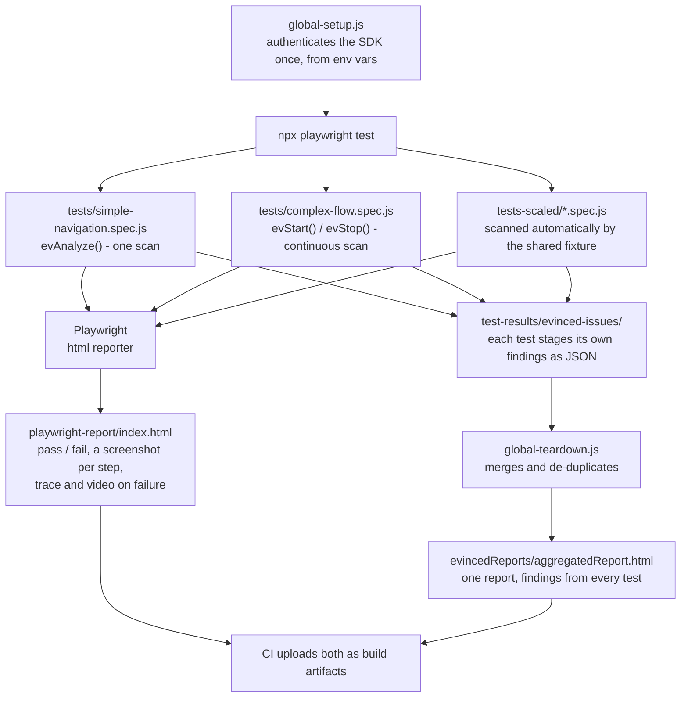
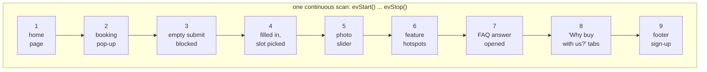

# Evinced Playwright JS SDK: Home Assignment

A Playwright test project demonstrating integration of the **Evinced JS
Playwright SDK** against [https://a11y-audits.com/](https://a11y-audits.com/)
("Love & Minter", a demo storefront deliberately built with WCAG failures so
that accessibility tooling has something real to find).

The project covers the three parts of the assignment:

1. **A simple navigation test**: one page, one state.
2. **A more complex flow with validations**: nine page states covering the
   home page's main widgets and a booking form that rejects an empty submit.
3. **Evinced integrated with the relevant scanning mode per test**, plus an
   HTML report saved from every run, with screenshots.

A fourth piece, `fixtures/` and `tests-scaled/`, answers the natural follow-up
question of how this integration would scale to a suite of hundreds of specs.
Only `tests-scaled/` uses that fixture: the two tests above deliberately call the
SDK by hand instead, because their job is to show the raw mechanics and the
difference between the two scanning modes. In a real suite every spec would use
the fixture.

---

## Repository layout

| Path | Purpose |
|---|---|
| `tests/simple-navigation.spec.js` | Test 1. Loads the home page, asserts the title and primary navigation, then runs a single Evinced scan. |
| `tests/complex-flow.spec.js` | Test 2. Exercises the home page's widgets (booking form including a rejected empty submit, photo slider, feature hotspots, FAQ, "Why buy with us?" tabs and the footer sign-up) across nine page states under one continuous Evinced scan. |
| `fixtures/evinced-fixtures.js` | A Playwright fixture that starts, stops and records an Evinced scan for every test automatically. |
| `fixtures/evinced-aggregate.js` | Collects each test's findings and merges them into one accessibility report. |
| `tests-scaled/example-using-fixture.spec.js` | Two tests that contain no Evinced code at all yet are still scanned; the fixture does it. |
| `global-setup.js` | Runs once before the suite; authenticates the SDK from environment variables. |
| `global-teardown.js` | Runs once after the suite; writes the single merged accessibility report. |
| `evConfig.json` | Evinced SDK configuration. `enableScreenshots` is what makes the scanner capture a screenshot of each element it raises a finding against. |
| `playwright.config.js` | Test discovery, reporters, `baseURL`, screenshot/trace/video capture, global setup and teardown. |
| `.npmrc` | Points the `@evinced` scope at Evinced's private JFrog registry; the token comes from the environment. |
| `.github/workflows/playwright.yml` | CI: installs dependencies, runs the suite, uploads the two reports as artifacts. |

---

## How it fits together



One run, two reports, because they answer two different questions: Playwright's
is the test report, Evinced's is the accessibility report. Every test stages its
own findings, whichever scanning mode it used, and the teardown merges them, so
the accessibility report is complete no matter how a test was written.

---

## Scanning modes: one per test, chosen deliberately

The Evinced SDK offers two ways to scan, and the assignment asks for the
relevant mode per test. They are not interchangeable:

**`evAnalyze()`, the single scan.** Scans whatever is on screen at the moment it is
called and resolves to the issues found. Used in `simple-navigation.spec.js`,
which loads one page and never changes it. A single snapshot is all there is to
capture.

**`evStart()` / `evStop()`, the continuous scan.** Watches DOM mutations and
navigations for everything between the two calls. Used in
`complex-flow.spec.js`, where the DOM changes shape repeatedly: an accordion
panel expands, a modal mounts, a wizard advances a step, a date picker renders.
A single `evAnalyze()` at the end of that test would only ever see the final
screen and would miss the six states before it.

`evStart()` is called *before* the first `page.goto()` so the initial page load
is part of the recording rather than something that happened before it began.

The nine states that one continuous scan covers in `complex-flow.spec.js`:



---

## Reports

A run produces two separate reports, because they answer two different
questions.

### 1. Playwright's HTML report: `playwright-report/`

Produced by Playwright's built-in `html` reporter. This is the *test* report: it
shows which tests passed, and for each test a screenshot of every step, plus a
trace and video for any failure. `screenshot: 'on'` in `playwright.config.js` is
what captures a screenshot after every step rather than only on failure, which
is what satisfies the "report should include screenshots" requirement.

```bash
npm run report      # opens the last HTML report in a browser
```

### 2. Evinced's accessibility report: `evincedReports/aggregatedReport.html`

Produced by `global-teardown.js`. This is the *accessibility* report: the issues
found across every `evAnalyze()` and `evStart()`/`evStop()` scan in the run,
merged into a single file and grouped by issue type with severity and the
elements involved. Each finding carries a screenshot of the element it was
raised against. It is a findings list rather than a walkthrough, so it does not
have the screenshot-per-step sequence the Playwright report does.

The SDK ships its own Playwright reporter, and this project deliberately does
not register it. That reporter is only ever handed results from `evStop()`, so a
test written with `evAnalyze()` is invisible to it and its findings would be
missing from the report. Instead every test hands what it found to
`stageIssues()`, which drops it in `test-results/evinced-issues/` as JSON, and
the teardown merges the lot with the SDK's own `getOnlyUniqueIssues()` and
`saveReport()`. Mixing scanning modes then costs nothing: one report, every
test, either mode.

The SDK keeps the screenshots apart from the issues, in a map the report looks
up by id while it is being drawn, so a test stages its screenshot map alongside
its findings and the teardown merges those too. Without that the report would
list every issue correctly and show a picture of none of them.

Not every finding ends up with one. The SDK photographs the page each time a
batch of new findings appears, and when that in-page capture throws it still
mints a screenshot id and stamps it on the findings in that batch, which leaves
them pointing at an entry with nothing behind it. Roughly a third of the
findings in a run land this way. Nothing in this project can recover those, so
the merge does the next best thing and puts the findings that do have a picture
at the top of the report.

The map only fills up if the scanner was told to take the pictures in the first
place, and the switch for that is the flat `enableScreenshots` key in
`evConfig.json`. It is worth being specific about this because the SDK reads
exactly that key and ignores everything else in the file it does not recognise,
so a nested, plausible-looking `scan.screenshots.enabled` is silently no
configuration at all: the scans run, the report builds, every finding is
correct, and not one of them has an image.

---

## Accessibility findings vs. test failures

These are deliberately kept apart, and it is worth being explicit about why.

A failed Playwright assertion means *the test could not complete*: the page
didn't behave as the test required. An accessibility finding means *the site has
a defect*, which is the entire point of running the scan, and is expected on a
site built to demonstrate WCAG failures. If both turn CI red, a red build stops
carrying information: you cannot tell a genuine functional break from a known,
already-catalogued accessibility bug.

So the split is:

- **Functional behaviour** is asserted normally. If the wizard won't advance, the
  test fails.
- **Accessibility findings** go to the Evinced report, and only there. The spec
  files drive the page and assert that it *works*; they do not hand-check
  accessibility properties. A hand-written check is a frozen snapshot of
  whatever the author happened to notice on one day, and it says nothing about
  a problem introduced next week. The scanner is the thing that keeps looking.

If you later want CI to gate on accessibility, the clean way is to do it
explicitly: filter `evStop()`'s results by severity and assert on that:

```js
const issues = await evincedService.evStop();
const critical = issues.filter(i => i.severity.name === 'Critical');
expect(critical).toHaveLength(0);
```

That way the gate is a deliberate policy with a threshold you choose, rather
than an accident of where an assertion happened to be written.

---

## Locator strategy in `complex-flow.spec.js`

The test splits locators by what they are there to do.

**Plumbing: getting from one state to the next.** These steps aren't what's
under test; they just have to be reliable, so they use ids and scoped structure:
`#full_name`, `#email`, `#phone`, `#next-to-step-2`,
`button[aria-label="Close Modal"]`, and for the FAQ row a component class
narrowed by the text it contains:

```js
page.locator('.accordion', { hasText: 'Do you ship overseas?' })
    .locator('button.circle-chevron')
```

Classes alone wouldn't be enough here: there are six `.accordion` blocks and six
`button.circle-chevron` on the page, and the three contact inputs carry no class
at all, so the class is always scoped by containing text or by the dialog.

**Assertions: what the test is actually checking.** These stay role- and
name-based where the page allows it (`getByRole('heading', { name: 'FAQ' })`,
`getByRole('tab')`, `getByRole('img')`), because that is how a screen reader
finds things too: if a locator like that can't find an element, that is worth
knowing. The findings themselves are left to the Evinced scan.

Two workarounds remain, and both are about interaction rather than addressing:

- **`{ force: true }` on the Next button.** It carries `aria-disabled="true"`
  without a native `disabled` attribute, so Playwright treats it as not enabled
  and waits for it until the test times out, while a real user's click goes
  through. No choice of locator changes this.
- **Clicking the date/time `label`, not the `input`.** All five radios in each
  group are absolutely positioned in one shared bounding box, so clicking an
  input's centre point hits whichever is painted on top. The labels are the
  visible tiles and have their own boxes, so a plain `.click()` on the label
  selects the right one, which is also what a real user does. `.first()` takes
  whatever is offered, since the dates move with the calendar and the time slots
  are randomised on every page load.

---

## Credentials

No secret is committed to this repository. Three values are needed, always read
from the environment:

| Variable | Used for | Where it is set |
|---|---|---|
| `EVINCED_JFROG_TOKEN` | `npm install` auth against the private `@evinced` package | local `.env` (git-ignored) / GitHub repo secret |
| `EVINCED_SERVICE_ID` | SDK authentication in `global-setup.js` | local `.env` / GitHub repo secret |
| `EVINCED_API_KEY` | SDK authentication in `global-setup.js` | local `.env` / GitHub repo secret |

`global-setup.js` fails fast with an explanatory message if the two SDK
variables are missing, rather than letting every test fail with an opaque
authorization error.

---

## Running locally

```bash
cp .env.example .env                       # fill in the values Evinced provided
export $(grep -v '^#' .env | xargs)        # load them into the shell
npm install                                # needs EVINCED_JFROG_TOKEN to be set
npx playwright install --with-deps chromium
npm test                                   # run the whole suite
npm run report                             # open the Playwright HTML report
```

Useful subsets:

```bash
npm run test:simple     # just the navigation test
npm run test:complex    # just the booking flow
npm run test:scaled     # just the fixture-based examples
npm run test:headed     # watch it run in a visible browser
```

---

## Continuous integration

`.github/workflows/playwright.yml` runs on every push to `main`, on pull
requests, and on manual dispatch. It installs dependencies (including the
private Evinced package, authenticated from the repo secret), installs Chromium,
runs the suite, and uploads both reports as build artifacts with `if: always()`
so they are available whether the run passed or failed. There are two artifacts,
not three: the accessibility findings from every test arrive in the one merged
report.

To see the results: open the **Actions** tab, pick a run, and download the
`playwright-report` and `evinced-report` artifacts from the Artifacts section at
the bottom of the run summary. Unzip and open `index.html` and
`aggregatedReport.html` respectively.

Before the first CI run, add the three secrets above under
**Settings → Secrets and variables → Actions**. Without `EVINCED_JFROG_TOKEN`
the very first step (`npm install`) fails with a registry authentication error.

The suite runs with `retries: 1` on CI and `fullyParallel: true`, across a
single Chromium project.
